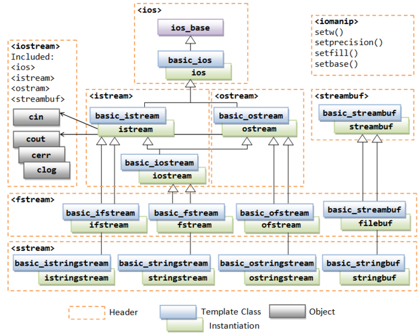
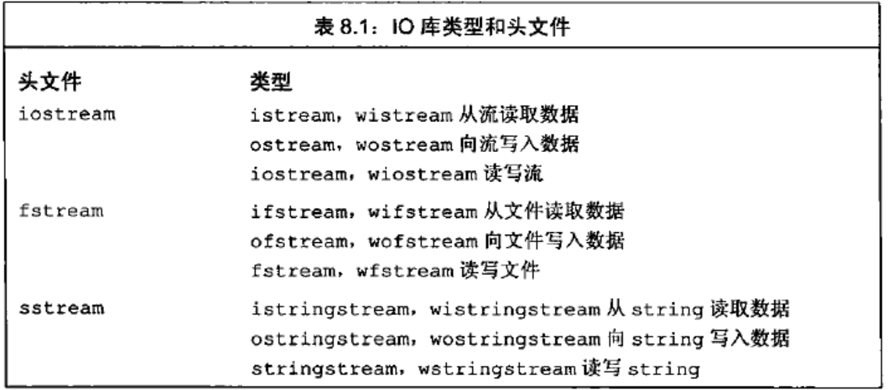

C++语言不直接处理输入输出，而是通过一簇定义在标准库中的类型来处理IO。这些类型支持从设备读取数据、向设备写入数据的IO操作，设备可以是文件、控制台窗口等。还有一些类型允许内存IO，即，从string读取数据，向string写入数据。

C++/C++11中头文件<iostream>定义了标准输入/输出流对象。包含了<iostream>也自动包含了<ios>、<streambuf>、<istream>、<ostream>和<iosfwd>。

头文件<iostream>中的对象包括：

(1)、narrow characters(char)即窄字符：cin(standard input stream (object))、cout(standard output stream (object))、cerr(standard output stream for errors (object))、clog(standard output stream for logging (object))；

(2)、wide characters(wchar_t)即宽字符：wcin(standard input stream (wide) (object))、wcout(standard output stream (wide)  (object))、wcerr(standard output stream for errors  (wide)  (object))、wclog(standard output stream for logging (wide) (object))。

IO库：

(1)、istream(输入流)类型，提供输入操作；

(2)、ostream(输出流)类型，提供输出操作；

(3)、cin，一个istream对象，标准输入流，用来从标准输入读取数据；

(4)、cout，一个ostream对象，标准输出流，从标准输出写入数据，输出可以重定向( “>” 或“1>”)到一个指定文件中；用于将数据写入标准输出，通常用于程序的正常输出内容。

(5)、cerr，一个ostream对象，标准错误流，通常用于输出程序错误信息或与其它不属于正常逻辑的输出内容，写入到标准错误，默认情况下，写到cerr的数据是不缓冲的；错误信息可以直接发送到显示器，而无需等到缓冲区或者新的换行符时，才被显示；可以通过” 2> ”方式重定向输出到指定文件中；cerr通常用于输出错误信息或其它不属于程序正常逻辑的输出内容。

(6)、clog：一个ostream对象，标准错误流，关联到标准错误；与cerr区别：cerr和clog都是标准错误流，区别在于cerr不经过缓冲区，直接向显示器输出信息，而clog中的信息默认会存放在缓冲区，缓冲区满或者遇到endl时才输出；默认情况下，写到clog的数据是被缓冲的。clog通常用于报告程序的执行信息，存入一个日志文件中。

(7)、>>运算符，用来从一个istream对象读取输入数据；

(8)、<<运算符，用来向一个ostream对象写入输出数据；

(9)、getline函数，从一个给定的istream读取一行数据，存入一个给定的string对象中。

IO库类型和头文件：iostream定义了用于读写流的基本类型，fstream定义了读写命名文件的类型，sstream定义了读写内存string对象的类型，如下图：

为了支持使用宽字符的语言，标准库定义了一组类型和对象来操纵wchar_t类型的数据。宽字符版本的类型和函数的名字以一个w开始。例如，wcin、wcout和wcerr是分别对应cin、cout和cerr的宽字符版对象。宽字符版本的类型和对象与其对应的普通char版本的类型定义在同一个头文件中。